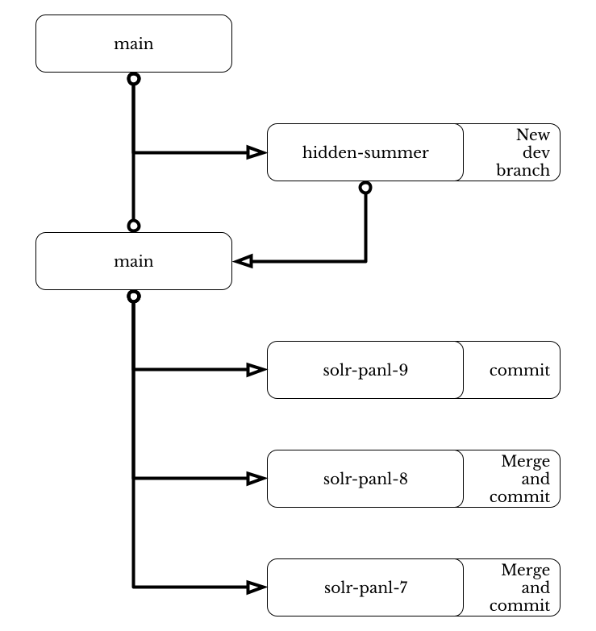

# Instructions for Development Process

> IMPORTANT: you REALLY want to run the integration tests against a live Solr instance with indexed data.
> See the section at the end of this document about integration tests and naming etc.

## 1. Name the new version 

Find a suitable name for the new version and branch - an example site is the [Release name generator](https://codesandbox.io/p/sandbox/release-name-generator-5ow5w?file=%2Fsrc%2Findex.js) 
which somehow (_sort-of_) relates to the release.  The next release may very well be called `hidden-summer` as there may 
be some boost terms added to queries.

## 2. Create a branch 

Create a branch from the `main` branch with the above name i.e. `hidden-summer`.

## 3. Work, work, work

Do the work, run the tests, but don't forget the following:

### a. Update the version

See the file `src/main/resources/gradle.properties` and update the following properties:

The Synapticloop Panl project uses `major.minor.micro` versioning, the meaning of which:

- `major` - the major version will increment when there is a breaking change to the Panl LPSE URL.  Upon increment of the major version, both the minor and micro version number will be reset to 0 (zero).
- `minor` - the micro version will increment when there is additional functionality added to the release.  Upon increment of the minor version, the micro number will be reset to 0 (zero).
- `micro` - the micro version will increment for bug fixes only.

The book version matches the version of the Synapticloop Project version.  Any changes to the book without any changes to the codebase will be updated on the `main` branch and the `ghpages` based website will be updated.

The Panl releases will not reflect any book updates.

### b. Run all tests

This includes both the unit tests `./gradlew test` and the integration tests `./gradlew testIntegration`

The integration tests are the best tests to run as they will ensure that specific facets will be able to be removed and added, inverted etc.

### c. Run the site spider integration tests

This will take a bit of time as it tests a lot of live URLs

```./gradlew testIntegrationSpider```

This may take quite some time....

### d. Update the README file

The following parts need to be updated:

1. The table of branch release status
   2. remove old branches (leave `MAIN`, `SOLR PANL 9`, `SOLR PANL 8`, `SOLR PANL 7`)
   3. add new branch `hidden-summer` and get the circle-ci badges for the build
2. Ensure that the Section "_Why Synapticloop Panl?_" is up-to-date 
2. Ensure that the Section "_Additional Panl Niceties_" is up-to-date 
3. Update the In-built Panl web app images (see `src/main/docs` for images) and the descriptions 
4. Add in the section for Version History with all details - use previous versions as a template

### e. Don't forget the `Getting Started With Synapticloop Panl` 

Update this as you you go along.

> Create a copy of the file with the previous version number - this is an archive.

## 3. Merge back the changes

> Ensure that you run both unit and integration tests for all branches.  You will need to spin up the latest version for 
> each of the Solr release versions (and possibly reindex the data).




### 1. Merge back to the `main` branch

Merge all changes to the main version, there should be no conflicts....  but resolve them.

1. checkout `main`
2. merge the branch `hidden-summer` on to the `main` branch
1. test
1. commit
1. push


### 2. Merge into to the `solr-panl-9` branch

There should be no conflicts as the `main` branch is linked to Solr version 9, this will change when Solr releases their 
version 10.

1. checkout `solr-panl-9`
1. merge the branch `main` on to the `solr-panl-9` branch - there should be no conflicts as the main branch and the Solr version are the same
1. test
1. commit
1. push


### 3. Merge into to the `solr-panl-8` branch

There **MOST PROBABLY WILL BE** conflicts if any of the individual files that deal with the integration points have 
changed.

1. checkout `solr-panl-8`
1. merge the branch `main` on to the `solr-panl-8` branch
1. test
1. commit
1. push

The files most likely to conflict are:

 - `build.gradle` (especially around dependencies)
 - Anything in the `com.synapticloop.panl.server.client` package
 - Maybe some tests...

### 3. Merge into to the `solr-panl-7` branch

There **MOST PROBABLY WILL BE** conflicts if any of the individual files that deal with the integration points have
changed.

1. checkout `solr-panl-7`
1. merge the branch `main` on to the `solr-panl-7` branch

The files most likely to conflict are:

- `build.gradle` (especially around dependencies)
- Anything in the `com.synapticloop.panl.server.client` package
- Maybe some tests...

## 4. Get ready for release

Create a new release which matches the `src/main/resources/gradle.properties` file with the `panl.version` number.

This is done through the github releases page: [Github Releases](https://github.com/synapticloop/panl/releases).

This will also tag the release

The notes should be the same as those as are in the `README.md` file.

Upload the `.zip` and `.tar` files 

Upload pdf of the book 

Release

## 5. Update the documentation

Remember

 - Page 1 - update the Version
 - Update the `Additional Functionality in the Pipeline` (page 320 ish)
 - Update the table of contents (including changing the font of the table of contents to Libre Baskerville)

The book can be found [Getting Started With Panl](https://docs.google.com/document/d/1r2LVM0KGUI7NWdMVm4TE0e7SOS2qF2Mk6TptLoL1BcU/edit?tab=t.0) 
although access must be granted to individuals wishing to edit the documentation (Google Drive based document).


1. Save the book as `Web-page/html`
2. Checkout the `ghpages` branch
3. Save the HTML file into the `src/docs` directory (Overwrite the file)
4. Save all images into the `book/images` directory (Overwrite any that exist)
5. Run the `src/main/java/com/synapticloop/debookeriser/Main.java` file
6. Commit the files
7. Push the files


# INTEGRATION Tests

## Finding/Naming Them

The source code lives in `src/testintegration/java/`

All Facets and Facet type options should be tested in conjunction with all other facet types and options.

The Facet Types

1. REGULAR - keyed on `testRegular`
1. REGULAR MultiValued - keyed on `testMulti`
1. BOOLEAN - keyed on `testBoolean`
1. RANGE - keyed on `testRange`
1. DATE Range - keyed on `testDate`
1. OR - keyed on `testOr`
1. OR Separator - keyed on `testOrSep`

Depending on which way you want to look at things, a test for a RANGE facet with a Regular Multi facet may be in the `RangeTest`, or the `MultiTest` class 

Don't forget to test sorting (include multi sort) and query operands

### The Default Test(s)

All tests should have the following test method signature

All Tests __should__ extend the abstract TestBase, which defines the following mandatory methods:

`@Test public void testDefault() throws Exception;` - test the default add/remove/invert etc.

`@Test public abstract void testSortDefault() throws Exception;` - test one sorting level

`@Test public abstract void testSortHierarchy() throws Exception;` - test two sorting levels

see the class `com.synapticloop.integration.test.facet.TestBase` for the full list


