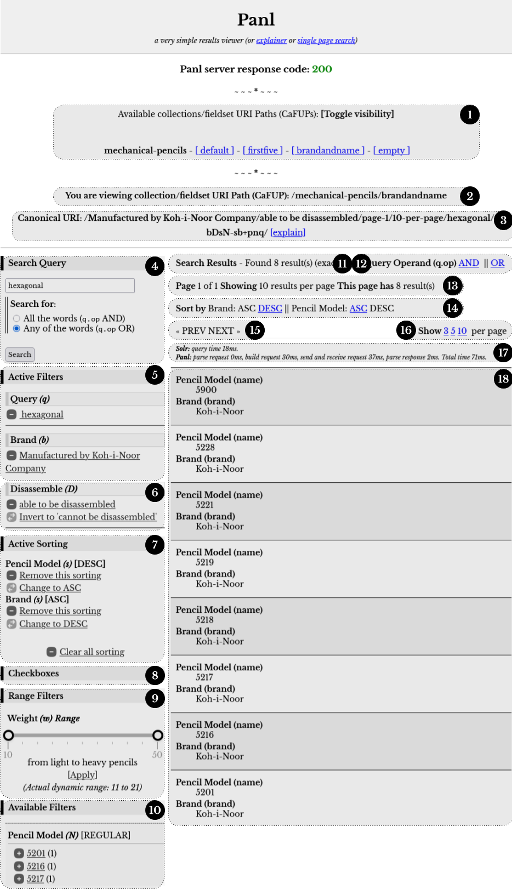

# Synapticloop PANL

**_WORK IN PROGRESS_**

Usable, but not released... yet...  The book and generated instructions are coming along nicely. 

[https://synapticloop.github.io/panl/](https://synapticloop.github.io/panl/)

**_Get up and running with a fully featured, SEO friendly, keyword searchable, faceted search engine with an in-built, example search page to test it all out._**

## Why?

Because...

`/Caran+d'Ache/true/Black/bDW/` 

looks A LOT nicer than

`q=*:*&facet.mincount=1&rows=10&facet.field=lead_size_indicator&facet.field=grip_material&facet.field=colours&facet.field=nib_shape&facet.field=diameter&facet.field=cap_shape&facet.field=brand&facet.field=mechanism_type&facet.field=length&facet.field=hardness_indicator&facet.field=grip_type&facet.field=cap_material&facet.field=lead_grade_indicator&facet.field=tubing_material&facet.field=in_built_sharpener&facet.field=disassemble&facet.field=category&facet.field=body_shape&facet.field=clip_material&facet.field=mechanism_material&facet.field=lead_length&facet.field=body_material&facet.field=in_built_eraser&facet.field=grip_shape&facet.field=relative_weight&facet.field=name&facet.field=nib_material&facet.field=weight&facet.field=variants&facet=true&fq=brand:"Caran+d'Ache"&fq=disassemble:"true"&fq=colours:"Black"&q.op=AND`

# Why Synapticloop Panl?
Panl was designed to convert rather long and unfriendly (both in human readable and SEO terms) to shorter, nicer, and friendlier URI paths.

Working with a Solr schema, the Panl configuration files translate unwieldy URI parameters into concise and precise URI paths.

Panl allows

- Multiple ways to slice and dice the underlying Solr collection and present them with different URLs
- Prefixes, Infixes, and Suffixes for all facets
- Value replacements for Boolean data types
- Field value validation to help catch common errors
- Hierarchical facets, only showing specific facets if another facet has already been selected
- Sorting of facet values by either count (the default) or value.
- Sorting by any of the fields or facets
- Pagination - in built and ready to go
- Static site generation - for small datasets with few options.  Alternatively they can be seen as easily cacheable and canonical sources for the returned results.

# Getting up to Speed... Fast!

The Solr Panl release package was designed to get you up and running as quickly as possible.

With the in-built tool, point it at your existing Solr `managed-schema.xml` file, run the Panl server and view the results.  From there you can tweak the configuration, generate new configurations and see your results in an instant.

## The Panl Results Viewer Web App



_**Image**: The features and functionality of the Panl server_

_The image is a screenshot of the in-built Panl Results Viewer Web App available in the release package, and whilst not intended as a production search page, can be used to fine-tune the configuration, or just to have a quick overview of the results._

1. **A list of available Collections and FieldSet URI Paths (CaFUPs)** that Panl is configured to serve.  CaFUPs enable different Solr fields to be returned in the documents with the same search parameters.

1. **A textual representation of the CaFUPs** that the Panl Results Viewer web app is using.

1. **The canonical URI path** (which is returned with the Panl results JSON object) - this is important as multiple Panl LPSE URI paths will return exactly the same results - this is the unique URI path for this result set and necessary for de-duplicating the search engine results.  This also includes a link to the Panl Results Explainer web app.

1. **The search query box**, by default, Panl responds to the same parameter name as The Solr server - i.e. 'q'.  This can be configured to be a different value should you choose.

1. **Active filters** - either queries, selected facets, or sorting options that are currently limiting the results - the [Remove] link is the URI path that will remove this query, facet, or sorting option from the results. If it is an active sorting filter, the [Change to DESC] or [Change to ASC] links will invert the sorting order without affecting any further sub-ordering.

1. **Range filters** - for facets that are defined as ranges - allowing end-users to select a range of values - the values are inclusive (i.e. include the minimum and maximum values).

   **Date Range filters (not shown)** - Enabling searching on a range of dates (but not a specific date) in the form of:
   next/previous <any_integer> hours/days/months/years.
    - For example:
    - Last 30 days
    - Previous 24 hours

1. **Available filters** - additional facets that can further refine and limit the Solr search results.

1. **Number of results found**, and whether this is an exact match.

1. **Query operand** - whether the query is OR, or AND, this affects the search query, not the faceting - i.e. the Solr server q.op parameter.

1. **Page information**, the number of pages, how many results are shown per page, and how many results are shown on this page.

1. **Sorting options** - Whether to sort by relevance (the default) or by other configured sorting options with ascending and descending options available.  Any Solr field can be configured to be used as a sorting option.  And multi-sort orders are available, allowing sorting on more than one field.

1. **Pagination options** - the Panl server returns all information needed to build a pagination system, number of results, number of results shown per page and the current page number.

1. **Number of results per page**. Note: The values 3,5,10 are just examples - this can be set to any positive integer number.

1. **Timing information** about how long the Panl server took to build and return the results (including how much time the Solr server took to find and return the results).

1. **The results** -  the fields that are returned with the documents and are shown in the results sections which are configured by the CaFUPs. Multiple field sets can be configured for the collection.

## The Panl Results Explainer Web App


_**Image**: The features and functionality of the Panl results explainer_

_The image is a screenshot of the in-built Panl Results Explainer Web App available in the release package, and whilst not intended as a production search page, can be used to look into, troubleshoot, and fine-tune the configuration._

1. **A list of available Collections and FieldSet URI Paths (CaFUPs)** that Panl is configured to serve.  CaFUPs enable different Solr fields to be returned in the documents with the same search parameters.
1. **A textual representation of the CaFUPs** that the Panl Results Viewer web app is using.
1. **The canonical URI path entry field** allows you to enter any canonical URI path and have the parsing and tokenising explained to you, including whether the parsed token was valid, the LPSE code found and the original value that Panl attempted to decode.
1. **The request token explainer** - for any canonical URI entered, this will list the parsing and decoding steps, with the following details
   1. Whether the token is valid (if it is invalid, it will be ignored and not passed through to the Solr search server),
   1. The type of token that was found,
   1. The LPSE code,
   1. The parsed value,
   1. The original value, and
   1. Where pertinent, additional information pertaining to the specific code.
1. **Configuration parameters** - parameters that are not fields or facets with information about the value, a description, and the property that set the value.
1. **Field configuration explainer** - for each of the fields or facets that are configured in the LPSE order an explanation of their configuration including:
   1. The type of Java field type,
   1. The LPSE code,
   1. The Solr field name,
   1. The Solr field type, the Panl field name, and
   1. Additional configuration items which may include Prefixes, Suffixes, Ranges, Facet type, or Minimum/maximum values
   1. **Any configuration warning messages** that were found whilst parsing the properties files.

## Additional Panl Niceties

1. **MULTIPLE ways to 'SLICE and DICE'** - From one Solr collection, the Panl server can present the results and facets in multiple different ways, providing individual use cases for specific needs.

1. **PREFIXES and SUFFIXES** - Panl can also add prefixes and suffixes to the URI path to increase readability, for example, with configuration.  For the example LPSE URI path of `/Caran+d'Ache/true/Black/bDW/` could also have the brand Solr field prefixed with ‘Manufactured By ’ and suffixed by ‘ Company’ to produce the URI path
`/Manufactured+By+The+Caran+d'Ache+Company/true/Black/bDW/`

1. **BOOLEAN field translations**, for any Solr field that is defined as a solr.BoolField, then an additional translation can be performed.  ‘True’ and ‘false’ values can be replaced with arbitrary text, which will be transparently converted between Panl and Solr.  For the LPSE URI path of `/Caran+d'Ache/true/Black/bDW/` the true value (which is defined as whether the mechanical pencil can be disassembled could be changed to ‘Able to be disassembled’ for true values, and ‘Cannot be disassembled’ for false values.  The above URI path would then become
`/Caran+d'Ache/Able+to+be+disassembled/Black/bDW/`

1. **FIELD VALUE validation** - By default, Solr can error when an invalid value is passed through - for example, if Solr is expecting a numeric value and it could not be parsed.  Panl can protect against this, by attempting to parse the value as best it can, and silently dropping the parameter if it cannot be sensibly parsed.

1. **HIERARCHICAL facets** - Only show facets if a parent facet is currently selected, allowing you to narrow down the facet results and lead users through the search journey. 

1. **SORTED facets** - Each individual facet can be sorted by either the facet count (which is the default), or the facet value (e.g. alphabetic/numeric)

1. **SORTING options** -  sort by any of the Solr fields, either ascending, or descending and with multiple sub-sorting available - e.g. sorting by a brand name, than the model number

1. **PAGINATION** - easy to generate pagination URI paths giving you control of how you would like to implement it.

1. **STATIC SITE GENERATION** - With the exception of a query parameter, all available links for every conceivable URI path can be statically generated ahead of time, with canonical URLs.

1. **STATELESS** - No state is stored in the Panl server, all of the state is from the URI path part that is passed through.  No sessions, no memory.

# Quick Start - The 5 Steps

At the end of this chapter, you will have a web page up and running with the mechanical-pencils collection indexed and ready to sort and facet on the URL:
http://localhost:8181/panl-results-viewer/


_**Image**: The In-Build Panl Results Viewer Web Application_

## 0. Download Solr and Panl

Download the latest release of Synapticloop Panl - this example is using the 
`solr-panl-9-1.0.0` version.

[https://github.com/synapticloop/panl/releases](https://github.com/synapticloop/panl/releases)

Download the latest version of Apache Solr - this book is using the `9.6.0-slim` 
version

[https://solr.apache.org/downloads.html](https://solr.apache.org/downloads.html)

**A Note On Running The Commands**

*These are the commands for either Microsoft Windows or *NIX operating systems
(Linux/Apple Macintosh).  Should there be any errors - see the ‘Getting Started’ section for a more in-depth explanation and approach.***


```
**IMPORTANT**: You will need to replace the
SOLR_INSTALL_DIRECTORY
and
PANL_INSTALL_DIRECTORY
references in the commands for your particular setup.
```

# Windows Commands

```
**IMPORTANT**: Each of the commands - either Windows or *NIX must be run on a
 single line - watch out for continuations.
```

## 1. Create an example cloud instance

This requires no interaction, will use the default setup, two replicas, and two shards under the 'example' cloud node.
Command(s)

```shell
SOLR_INSTALL_DIRECTORY\bin\solr start -e cloud -noprompt
```


## 2. Create the mechanical pencils collection

This will set up the mechanical pencil collection and schema so that the data can be indexed.
Command(s)
```shell
SOLR_INSTALL_DIRECTORY\bin\solr create -c mechanical-pencils -d PANL_INSTALL_DIRECTORY\sample\solr\mechanical-pencils\ -s 2 -rf 2
```

## 3. Index the mechanical pencils data

This will index all mechanical pencil data into the Solr instance.
Command(s)

```shell
SOLR_INSTALL_DIRECTORY\bin\solr	post -c mechanical-pencils PANL_INSTALL_DIRECTORY\sample\data\mechanical-mechanical-pencils.json
```

## 4. Start the Panl Server

This will start the server and be ready to accept requests.
Command(s)
```shell
PANL_INSTALL_DIRECTORY\bin\panl.bat -properties PANL_INSTALL_DIRECTORY\sample\panl\mechanical-properties\panl.properties
```

## 5. Start searching and faceting

Open [http://localhost:8181/panl-results-viewer/](http://localhost:8181/panl-results-viewer/) in your favourite browser.

Choose a collection/fieldset and search, facet, sort, paginate and view the results

# *NIX Commands

```**IMPORTANT**: Each of the commands - either Windows or *NIX must be run on
 a single line - watch out for continuations.
 ```

## 1. Create an example cloud instance

No prompting, default setup, two replicas, and two shards under the 'example' cloud node.
Command(s)

```shell
SOLR_INSTALL_DIRECTORY/bin/solr start -e cloud -noprompt
```

## 2. Create the mechanical pencils collection

Set up the schema so that the data can be indexed.
Command(s)
```shell
SOLR_INSTALL_DIRECTORY/bin/solr create -c mechanical-pencils -d PANL_INSTALL_DIRECTORY/sample/solr/mechanical-pencils/ -s 2 -rf 2
```

## 3. Index the mechanical pencils data

Index all of the data into the Solr instance
Command(s)
```shell
SOLR_INSTALL_DIRECTORY/bin/solr post -c mechanical-pencils PANL_INSTALL_DIRECTORY/sample/data/mechanical-mechanical-pencils.json
```

## 4. Start the Panl Server

Ready to go.
Command(s)

```shell
PANL_INSTALL_DIRECTORY/bin/panl -properties PANL_INSTALL_DIRECTORY/sample/panl/mechanical-properties/panl.properties
```

View the in-built Panl Results Viewer web application
## 5. Start searching and faceting 

Open [http://localhost:8181/panl-results-viewer/](http://localhost:8181/panl-results-viewer/) in your favourite browser.

Choose a collection/fieldset and search, facet, sort, paginate and view the results

# Quick Info

## Starting up the example cloud

If you have stopped the example Solr server, starting it up:

### _Windows_

```shell
SOLR_INSTALL_DIRECTORY\bin\solr start -cloud -p 8983 -s "example\cloud\node1\solr"
SOLR_INSTALL_DIRECTORY\bin\solr start -cloud -p 7574 -s "example\cloud\node2\solr" -z localhost:9983
```

### _*NIX_

```shell
SOLR_INSTALL_DIRECTORY/bin/solr start -cloud -p 8983 -s "example/cloud/node1/solr"
SOLR_INSTALL_DIRECTORY/bin/solr start -cloud -p 7574 -s "example/cloud/node2/solr" -z localhost:9983
```

# Building The distribution

### _Windows_

```shell
gradlew.bat assemble
```

### _*NIX_

```shell
./gradlew assemble
```

The distributions (both a `.zip` and a `.tar` file) will be created in the build distributions directory.

I.e.
 - `./build/distributions` (*NIX), or
 - `.\build\distributions` (Windows)

with the release files named `solr-panl-9-x.x.x`