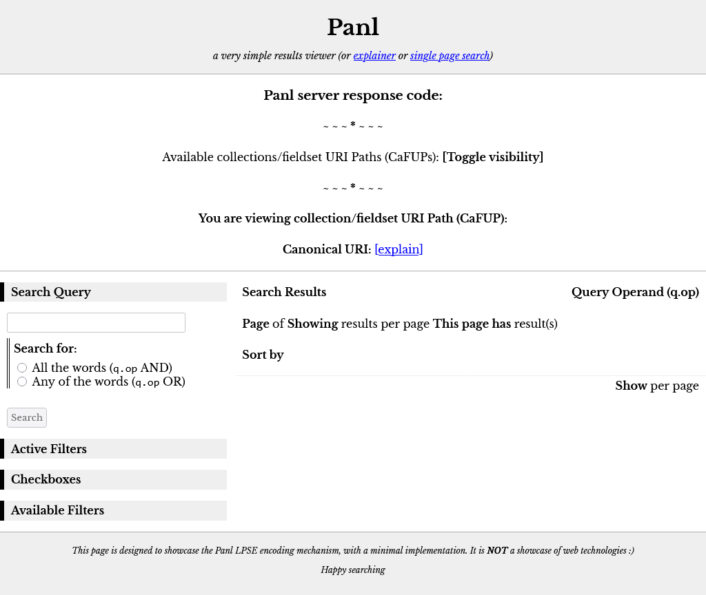

# Synapticloop PANL

**_WORK IN PROGRESS_**

Usable, but not released... yet...

**BECAUSE**

`/Caran+d'Ache/true/Black/bDW/` 

looks A LOT nicer than

`q=*:*&facet.mincount=1&rows=10&facet.field=lead_size_indicator&facet.field=grip_material&facet.field=colours&facet.field=nib_shape&facet.field=diameter&facet.field=cap_shape&facet.field=brand&facet.field=mechanism_type&facet.field=length&facet.field=hardness_indicator&facet.field=grip_type&facet.field=cap_material&facet.field=lead_grade_indicator&facet.field=tubing_material&facet.field=in_built_sharpener&facet.field=disassemble&facet.field=category&facet.field=body_shape&facet.field=clip_material&facet.field=mechanism_material&facet.field=lead_length&facet.field=body_material&facet.field=in_built_eraser&facet.field=grip_shape&facet.field=relative_weight&facet.field=name&facet.field=nib_material&facet.field=weight&facet.field=variants&facet=true&fq=brand:"Caran+d'Ache"&fq=disassemble:"true"&fq=colours:"Black"&q.op=AND`

# Why Synapticloop Panl?
Panl was designed to convert rather long and unfriendly (both in human readable and SEO terms) to shorter, nicer, and friendlier URI paths.

Working with a Solr schema, the Panl configuration files translate unwieldy URI parameters into concise and precise URI paths.


_**Image**: The features and functionality of the Panl server_

1. **A list of available Collections and FieldSets (CaFS) URIs** that Panl is configured to serve.  CaFS URI paths enable different Solr fields to be returned with the same search parameters.

1. **A textual representation of the CaFS URI** path that the Panl Results Viewer web application is using.

1. **The canonical URI path** (which is returned with the Panl results JSON object) - this is important as multiple Panl LPSE URI paths will return exactly the same results - this is the unique URI path for this result set.

1. **The search query box**, by default, Panl responds to the same parameter name as The Solr server - i.e. 'q'.  This can be configured to be a different value should you choose.

1. **Active filters** - either queries or selected facets that are currently limiting the results - the [Remove] link is the URI path that will remove this facet from the results.

1. **Available filters** - additional facets that can further refine and limit the results.

1. **Number of results found**, and whether this is an exact match.

1. **Query operand** - whether the query is OR, or AND, this affects the search query, not the faceting - i.e. the Solr server q.op parameter.

1. **Page information**, the number of pages, how many results are shown per page, and how many results are shown on this page.

1. **Sorting options** - Whether to sort by relevance (the default) or by other configured sorting options with ascending and descending options available.  Any Solr field can be configured to be used as a sorting option.

1. **Pagination options** - the Panl server returns all information needed to build a pagination system, number of results, number of results shown per page and the current page number.

1. **Number of results per page**. Note: The values 3,5,10 are just examples - this can be set to any positive integer number.

1. **Timing information** about how long the Panl server took to build and return the results (including how much time the Solr server took to find and return the results).

1. **The results** - the fields that are shown are configured by the CaFS.

## Additional Panl Niceties

1. **PREFIXES and SUFFIXES** - Panl can also add prefixes and suffixes to the URI path to increase readability, for example, with configuration.  For the example LPSE URI path of `/Caran+d'Ache/true/Black/bDW/` could also have the brand Solr field prefixed with ‘Manufactured By ’ and suffixed by ‘ Company’ to produce the URI path
`/Manufactured+By+The+Caran+d'Ache+Company/true/Black/bDW/`

1. **BOOLEAN field translations**, for any Solr field that is defined as a solr.BoolField, then an additional translation can be performed.  ‘True’ and ‘false’ values can be replaced with arbitrary text, which will be transparently converted between Panl and Solr.  For the LPSE URI path of `/Caran+d'Ache/true/Black/bDW/` the true value (which is defined as whether the mechanical pencil can be disassembled could be changed to ‘Able to be disassembled’ for true values, and ‘Cannot be disassembled’ for false values.  The above URI path would then become
`/Caran+d'Ache/Able+to+be+disassembled/Black/bDW/`

1. **FIELD VALUE validation** - By default, Solr can error when an invalid value is passed through - for example, if Solr is expecting a numeric value and it could not be parsed.  Panl can protect against this, by attempting to parse the value as best it can, and silently dropping the parameter if it cannot be sensibly parsed.

1. **SORTING options** - sort by any of the Solr fields, either ascending, or descending

1. **PAGINATION** - easy to generate pagination URI paths giving you control of how you would like to implement it.

1. **STATIC SITE GENERATION** - without a query parameter, the entire available links for every conceivable URI path can be statically generated ahead of time, with canonical URLs


# Quick Start - The 5 Steps

At the end of this chapter, you will have a web page up and running with the mechanical-pencils collection indexed and ready to sort and facet on the URL:
http://localhost:8181/panl-results-viewer/




_**Image**: The In-Build Panl Results Viewer Web Application_

## 0. Download Solr and Panl

Download the latest release of Synapticloop Panl - this example is using the 
`panl9-1.0.0` version.

[https://github.com/synapticloop/panl/releases](https://github.com/synapticloop/panl/releases)

Download the latest version of Apache Solr - this book is using the `9.6.0-slim` 
version

[https://solr.apache.org/downloads.html](https://solr.apache.org/downloads.html)

**A Note On Running The Commands**

*These are the commands for either Microsoft Windows or *NIX operating systems
(Linux/Apple Macintosh).  Should there be any errors - see the ‘Getting Started’ section for a more in-depth explanation and approach.***


```
**IMPORTANT**: You will need to replace the
SOLR_INSTALL_DIRECTORY
and
PANL_INSTALL_DIRECTORY
references in the commands for your particular setup.
```

# Windows Commands

```
**IMPORTANT**: Each of the commands - either Windows or *NIX must be run on a
 single line - watch out for continuations.
```

## 1. Create an example cloud instance

This requires no interaction, will use the default setup, two replicas, and two shards under the 'example' cloud node.
Command(s)

```shell
SOLR_INSTALL_DIRECTORY\bin\solr start -e cloud -noprompt
```


## 2. Create the mechanical pencils collection

This will set up the mechanical pencil collection and schema so that the data can be indexed.
Command(s)
```shell
SOLR_INSTALL_DIRECTORY\bin\solr create -c mechanical-pencils -d PANL_INSTALL_DIRECTORY\examples\mechanical-pencils\ -s 2 -rf 2
```

## 3. Index the mechanical pencils data

This will index all mechanical pencil data into the Solr instance.
Command(s)

```shell
SOLR_INSTALL_DIRECTORY\bin\solr	post -c mechanical-pencils PANL_INSTALL_DIRECTORY\examples\data\mechanical-mechanical-pencils.json
```

## 4. Start the Panl Server

This will start the server and be ready to accept requests.
Command(s)
```shell
PANL_INSTALL_DIRECTORY\bin\panl.bat -properties PANL_INSTALL_DIRECTORY\examples\mechanical-properties\panl.properties
```

## 5. Start searching and faceting

Open [http://localhost:8181/panl-results-viewer/](http://localhost:8181/panl-results-viewer/) in your favourite browser.

Choose a collection/fieldset and search, facet, sort, paginate and view the results

# *NIX Commands

```**IMPORTANT**: Each of the commands - either Windows or *NIX must be run on
 a single line - watch out for continuations.
 ```

## 1. Create an example cloud instance

No prompting, default setup, two replicas, and two shards under the 'example' cloud node.
Command(s)

```shell
SOLR_INSTALL_DIRECTORY/bin/solr start -e cloud -noprompt
```

## 2. Create the mechanical pencils collection

Set up the schema so that the data can be indexed.
Command(s)
```shell
SOLR_INSTALL_DIRECTORY/bin/solr	create -c mechanical-pencils -d PANL_INSTALL_DIRECTORY/examples/mechanical-pencils/conf/ -s 2 -rf 2
```

## 3. Index the mechanical pencils data

Index all of the data into the Solr instance
Command(s)
```shell
SOLR_INSTALL_DIRECTORY/bin/solr	post -c mechanical-pencils PANL_INSTALL_DIRECTORY/examples/data/mechanical-mechanical-pencils.json
```

## 4. Start the Panl Server

Ready to go.
Command(s)

```shell
PANL_INSTALL_DIRECTORY/bin/panl -properties PANL_INSTALL_DIRECTORY/examples/mechanical-properties/panl.properties
```

View the in-built Panl Results Viewer web application
## 5. Start searching and faceting 

Open [http://localhost:8181/panl-results-viewer/](http://localhost:8181/panl-results-viewer/) in your favourite browser.

Choose a collection/fieldset and search, facet, sort, paginate and view the results

# Quick Info

## Starting up the example cloud

If you have stopped the example Solr server, starting it up:

### _Windows_

```shell
SOLR_INSTALL_DIRECTORY\bin\solr start -cloud -p 8983 -s "example\cloud\node1\solr"
SOLR_INSTALL_DIRECTORY\bin\solr start -cloud -p 7574 -s "example\cloud\node2\solr" -z localhost:9983
```

### _*NIX_

```shell
SOLR_INSTALL_DIRECTORY/bin/solr start -cloud -p 8983 -s "example/cloud/node1/solr"
SOLR_INSTALL_DIRECTORY/bin/solr start -cloud -p 7574 -s "example/cloud/node2/solr" -z localhost:9983
```