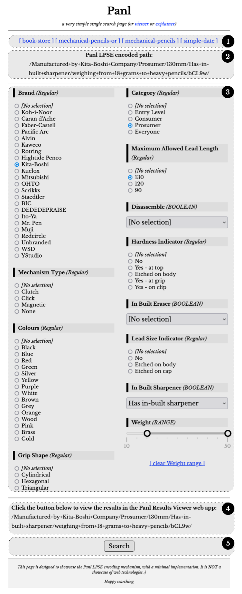

# Synapticloop PANL


&nbsp;anl&nbsp;Server

> **_Rapidly get up and running with a fully featured, SEO friendly, keyword
searchable, faceted search engine with an in-built, search page to test it all
out._**

---

```
# # # # # # # # # # # # # # # # # # # # # # # # # # # # # # # # # # # # # # # #
#                                        __                                   #
#                          .-----.-----.|  |.----.                            #
#                          |__ --|  _  ||  ||   _|                            #
#                          |_.-----.-----.--.--|  |                           #
#                            |  _  |  _  |     |  |                           #
#                            |   __|___._|__|__|__|                           #
#                            |__|     ... .-..                                #
#                                                                             #
#                                ~ ~ ~ * ~ ~ ~                                #
#                                                                             #
#                                                                             #
#                                  SOLR/PANL                                  #
#                                                                             #
#                                  ---------                                  #
#                                                                             #
# # # # # # # # # # # # # # # # # # # # # # # # # # # # # # # # # # # # # # # #
```

---

`Latest release tag:` 

`Latest release:` 

**Major branch release status:**

| BRANCH              | STATUS                                                                                                                                                                                                                                                                              | TYPE                                                          |
|---------------------|-------------------------------------------------------------------------------------------------------------------------------------------------------------------------------------------------------------------------------------------------------------------------------------|---------------------------------------------------------------|
| `MAIN`              | [](https://dl.circleci.com/status-badge/redirect/circleci/3Y1eqqe4mcvtSZuzJnQ3tJ/DyFKUm7c7AoLa1wHmRjAnf/tree/main)                           | Trunk - integrates with the latest Solr version (currently 9) |
| `SOLR PANL 9`       | [](https://dl.circleci.com/status-badge/redirect/circleci/3Y1eqqe4mcvtSZuzJnQ3tJ/DyFKUm7c7AoLa1wHmRjAnf/tree/solr-panl-9)             | Panl version for integrating with Solr version 9              |
| `SOLR PANL 8`       | [](https://dl.circleci.com/status-badge/redirect/circleci/3Y1eqqe4mcvtSZuzJnQ3tJ/DyFKUm7c7AoLa1wHmRjAnf/tree/solr-panl-8)             | Panl version for integrating with Solr version 8              |
| `SOLR PANL 7`       | [](https://dl.circleci.com/status-badge/redirect/circleci/3Y1eqqe4mcvtSZuzJnQ3tJ/DyFKUm7c7AoLa1wHmRjAnf/tree/solr-panl-7)             | Panl version for integrating with Solr version 7              |
| `billowing-feather` | [](https://dl.circleci.com/status-badge/redirect/circleci/3Y1eqqe4mcvtSZuzJnQ3tJ/DyFKUm7c7AoLa1wHmRjAnf/tree/billowing-feather) | Panl development release version 2.0.0                        |

> We _always_ recommend that you use the most recently available release which
> contains bug fixes and new functionality and is _generally_ backwards
> compatible.

The Synapticloop Panl project uses `major.minor.micro` versioning, the meaning
of which:

- `major` - the major version will increment when there is a **BREAKING CHANGE
  to the Panl LPSE URL**. Upon increment of the major version, both the minor
  and micro version number will be reset to 0 (zero).
- `minor` - the micro version will increment when there is additional
  functionality added to the release. Upon increment of the minor version, the
  micro number will be reset to 0 (zero).
- `micro` - the micro version will increment for bug fixes only.

The book version matches the version of the Synapticloop Project version. Any
changes to the book without any changes to the codebase will be updated on the
`main` branch and the `ghpages` based website will be updated.

ANy out-of-band book updates will not be reflected in the release updates.

# Instructions

## Download the Panl Server Release

1. [https://github.com/synapticloop/panl/releases](https://github.com/synapticloop/panl/releases)
2. Read
   the [5-Step Quick Start section](https://github.com/synapticloop/panl/tree/main?tab=readme-ov-file#quick-start---the-5-steps)
3. Done.

## Upgrading the Panl Server Release

Panl is designed to be a drop in replacement for your current version. Although
backwards compatibility is always the highest priority, do keep an eye out 
in the release notes for any breaking features.

Your existing configuration files should just work with the downloaded release
package.

## Read the Documentation

- Online book (
  HTML): [https://synapticloop.github.io/panl/](https://synapticloop.github.io/panl/)
- Offline book (
  PDF): [Getting Started With Synapticloop Panl.pdf](https://github.com/synapticloop/panl/blob/main/src/dist/book/Getting%20Started%20With%20Synapticloop%20Panl.pdf)
  _(over 400 pages of documentation, written with you, the integrator, in mind)_

Both of the book links above refer to Solr Panl integration 9 with instructions
for setting up and running earlier versions of Solr.

## Why?

Because...

`/Caran d'Ache/true/Black/bDW/`

looks A LOT nicer than

`q=*:*&facet.mincount=1&rows=10&facet.field=lead_size_indicator&facet.field=grip_material&facet.field=colours&facet.field=nib_shape&facet.field=diameter&facet.field=cap_shape&facet.field=brand&facet.field=mechanism_type&facet.field=length&facet.field=hardness_indicator&facet.field=grip_type&facet.field=cap_material&facet.field=lead_grade_indicator&facet.field=tubing_material&facet.field=in_built_sharpener&facet.field=disassemble&facet.field=category&facet.field=body_shape&facet.field=clip_material&facet.field=mechanism_material&facet.field=lead_length&facet.field=body_material&facet.field=in_built_eraser&facet.field=grip_shape&facet.field=relative_weight&facet.field=name&facet.field=nib_material&facet.field=weight&facet.field=variants&facet=true&fq=brand:"Caran+d'Ache"&fq=disassemble:"true"&fq=colours:"Black"&q.op=AND`

# Why Synapticloop Panl?

Panl was designed to convert rather long and unfriendly (both in human-readable
and SEO terms) to shorter, nicer, and friendlier URL paths throughout the entire
search journey.

Working with a Solr schema, the Panl configuration files translate unwieldy URL
parameters into concise and precise URL paths.

- **Have SEO friendlier URL paths with much shorter URLs than traditional query
  parameters** - This was the primary driver and the base functionality.

- **Abstract away the complexities of the Solr query string** - Being able to
  have a simple interface through the URL which could generate complex queries.
  Not having to fully understand how Solr works in the back-end abstracts away
  the complexity of a front-end integrator and reduces the need to have the
  back-end and front-end understand each-other.

- **Be quick to start up and easy to configure** - During development of a
  solution, being able to iterate over a solution, or change the way that Panl
  is configured is a must have. Additionally, being able to upgrade the Panl
  server and have the configuration files be automatically picked up and work
  without any changes is a plus.

- **Protect Solr from errant queries** - Hiding the Solr implementation details
  from the end user and parsing, decoding, and validating the URL before passing
  the query through to Solr. Additionally, Solr has a tendency to return an
  internal server error when the query string is not as it expected, and this
  should not disturb the return of the results.

- **Be able to present the same Solr collection in multiple different ways** - A
  single Solr collection should be able to serve up different fields and facets
  from the result documents without any back-end logic.

- **Have a configuration file drive the generation of the UI as much as possible
  ** - Rather than hard-coding facets and then determining how to display them,
  being able to have a returned JSON response which can be interrogated to
  determine how the facets should be displayed.

## Additional Panl Niceties

1. **MULTIPLE ways to 'SLICE and DICE'** - From one Solr collection, the Panl
   server can present the results and facets in multiple different ways,
   providing individual use cases for specific needs.

1. **PREFIXES and SUFFIXES** - Panl can also add prefixes and suffixes to the
   URI path to increase readability, for example, with configuration. For the
   example LPSE URI path of `/Caran d'Ache/true/Black/bDW/` could also have the
   brand Solr field prefixed with ‘Manufactured By ’ and suffixed by ‘ Company’
   to produce the URI path
   `/Manufactured By The Caran d'Ache Company/true/Black/bDW/`

1. **BOOLEAN value translations**, for any Solr field that is defined as a
   `solr.BoolField`, then an additional translation can be performed. ‘True’ and
   ‘false’ values can be replaced with arbitrary text, which will be
   transparently converted between Panl and Solr. For the LPSE URI path of
   `/Caran d'Ache/true/Black/bDW/` the true value (which is defined as whether
   the mechanical pencil can be disassembled could be changed to ‘Able to be
   disassembled’ for true values, and ‘Cannot be disassembled’ for false values.
   The above URI path would then become
   `/Caran d'Ache/Able to be disassembled/Black/bDW/`

1. **CONDENSE multiple field values** - Rather than having a forward slash URL
   path separator for multiple values of the same facet (used in OR Facets and
   Multi-valued REGULAR facets), Panl can be configured to condense these values
   into a single path part, saving URL characters, and reducing URL length, and
   making the URL far more human-readable. For example, selecting pencils
   manufactured by `Faber-Castell` **OR** `Koh-i-Noor` could have the URI path
   of `/Manufactured by Koh-i-Noor/Manufactured by Faber-Castell/bb/`, with
   condensed multiple field values - this could be configured to become
   `/Manufactured by Koh-i-Noor, or Faber-Castell Co./b/` (with a value 
   separator configured to be `, or `).

1. **FIELD VALUE validation** - By default, Solr can error when an invalid value
   is passed through - for example, if Solr is expecting a numeric value and it
   could not be parsed. Panl can protect against this, by attempting to parse
   the value as best it can, and silently dropping the parameter if it cannot be
   sensibly parsed.

1. **HIERARCHICAL facets** - Only show facets if a parent facet is currently
   selected, allowing you to narrow down the facet results and lead users
   through the search journey.

1. **SORTED facets** - Each individual facet can be sorted by either the facet
   count (which is the default), or the facet value (e.g. alphabetic/numeric)

1. **MORE facets** - Request more facets where the number of facets return does
   not contain the full set.

1. **RESULTS SORTING options** - Sort by any of the Solr fields, either
   ascending, or descending and with multiple sub-sorting available - e.g.
   sorting by a brand name, than the model number.  Additionally Panl generates 
   URLs for the inverse of the sorting without impacting any sub-sorting.

1. **INTEGRATED TYPEAHEAD/LOOKAHEAD** - Retrieve results suggestions as you type
   in the query search box.

1. **PAGINATION** - All the data to easily generate pagination URL paths giving
   you options and control over your own implementation.

1. **STATIC SITE GENERATION** - With the exception of a query parameter, all
   available links for every conceivable URI path can be statically generated
   ahead of time, all with canonical URLs. Additionally, for search results
   which do not change frequently, the Panl JSON response Object can be cached
   for faster lookups.

1. **STATELESS** - No state is stored in the Panl server, all state is from the
   URL path part that is passed through. No sessions, no memory, nothing to
   backup, easy to update and quick to start and restart.

1. **CACHEABLE** - Unless the underlying Solr search document index changes,
   each Solr request is able to be cached.

1. **TEXT CONFIGURATION** - All configuration for Panl is based on text files
   (Java .properties) files so they can be stored in a source code management
   system. Additionally, upgrades to the Panl server are easy and with quick
   startup times, any configuration changes will be seen instantly.

# Getting up to Speed... Fast!

The Solr Panl release package was designed to get you up and running as quickly
as possible.

With the in-built tool, point it at your existing Solr `managed-schema.xml`
file, run the Panl server and view the results. From there you can tweak the
configuration, generate new configurations and see your results in an instant.

## The Panl Results Viewer Web App


_**Image**: The features and functionality of the Panl Simple Results Viewer Web
App_

_The image is a screenshot of the in-built Panl Results Viewer Web App available
in the release package, and whilst not intended as a production search page, can
be used to fine-tune the configuration, or just to have a quick overview of the
results._

1. **A list of available Collections and FieldSet URI Paths (CaFUPs)** that Panl
   is configured to serve. CaFUPs enable different Solr fields to be returned in
   the documents with the same search parameters.

1. **A textual representation of the CaFUPs** that the Panl Results Viewer web
   app is using.

1. **The canonical URI path** (which is returned with the Panl results JSON
   object) - this is important as multiple Panl LPSE URI paths will return
   exactly the same results - this is the unique URI path for this result set
   and necessary for de-duplicating the search engine results. This also
   includes a link to the Panl Results Explainer web app.

1. **The search query box**, by default, Panl responds to the same parameter
   name as The Solr server - i.e. 'q'. This can be configured to be a different
   value should you choose.

1. **Active filters** - either queries or any of the selected facets that have
   been used to refine the search results.

1. **Active BOOLEAN filters** - if the selected facet is a BOOLEAN facet (i.e.
   either true/false) then a link (`[≫]`) can be included to invert this
   selection (i.e. change the value from true if currently false and vice
   versa).

1. **Active sorting** - sorting options that are currently ordering the
   results - the `[-]` link is the URI path that will remove this query, facet,
   or sorting option from the results. If it is an active sorting filter, the
   `[≫] Change to DESC` or `[≫] Change to ASC` links will invert the sorting
   order without affecting any further sub-ordering.

1. **RANGE filters** - for facets that are defined as ranges - allowing
   end-users to select a range of values - the values are inclusive (i.e.
   include the minimum and maximum values).

   **DATE Range filters (not shown)** - Enabling searching on a range of dates 
   (but not a specific date) in the form of:
   next/previous <any_integer> hours/days/months/years.
    - For example:
    - Last 30 days
    - Previous 24 hours

1. **Available filters** - additional facets that can further refine and limit
   the Solr search results.

1. **Number of results found**, and whether this is an exact match.

1. **Query operand** - whether the query is OR, or AND, this affects the search
   query, not the faceting - i.e. the Solr server q.op parameter.

1. **Page information**, the number of pages, how many results are shown per
   page, and how many results are shown on this page.

1. **Sorting options** - Whether to sort by relevance (the default) or by other
   configured sorting options with ascending and descending options available.
   Any Solr field can be configured to be used as a sorting option. And
   multi-sort orders are available, allowing sorting on more than one field.

1. **Pagination options** - the Panl server returns all information needed to
   build a pagination system, number of results, number of results shown per
   page and the current page number.

1. **Number of results per page**. Able to dynamically set the number of results
   to return for the query. **Note:** In the above image, the values 3, 5, 10
   are just examples - this can be set to any positive integer number.

1. **Timing information** about how long the Panl server took to build and
   return the results (including how much time the Solr server took to find and
   return the results).

1. **The results** - the fields that are returned with the documents and are
   shown in the results sections which are configured by the CaFUPs. Multiple
   field sets can be configured for the collection.

## The Panl Results Explainer Web App


_**Image**: The features and functionality of the Panl results explainer_

_The image is a screenshot of the in-built Panl Results Explainer Web App
available in the release package, and whilst not intended as a production search
page, can be used to look into, troubleshoot, and fine-tune the configuration._

1. **A list of available Collections and FieldSet URI Paths (CaFUPs)** that Panl
   is configured to serve. CaFUPs enable different Solr fields to be returned in
   the documents with the same search parameters.
1. **A textual representation of the CaFUPs** that the Panl Results Viewer web
   app is using.
1. **The canonical URI path entry field** allows you to enter any canonical URI
   path and have the parsing and tokenising explained to you, including whether
   the parsed token was valid, the LPSE code found and the original value that
   Panl attempted to decode.
1. **The request token explainer** - for any canonical URI entered, this will
   list the parsing and decoding steps, with the following details
    1. Whether the token is valid (if it is invalid, it will be ignored and not
       passed through to the Solr search server),
    1. The type of token that was found,
    1. The LPSE code,
    1. The parsed value,
    1. The original value, and
    1. Where pertinent, additional information pertaining to the specific code.
1. **Configuration parameters** - parameters that are not fields or facets with
   information about the value, a description, and the property that set the
   value.
1. **Field configuration explainer** - for each of the fields or facets that are
   configured in the LPSE order an explanation of their configuration including:
    1. The type of Java field type,
    1. The LPSE code,
    1. The Solr field name,
    1. The Solr field type, the Panl field name, and
    1. Additional configuration items which may include Prefixes, Suffixes,
       Ranges, Facet type, or Minimum/maximum values
    1. **Any configuration warning messages** that were found whilst parsing the
       properties files.

## The Panl Single Page Search Web App



_**Image**: The In-Built Panl Single Page Search Web Application_

Panl also ships with a URL that will provide a separate JSON response, allowing
you to build a single page search interface, giving your users all the options
at a glance.

1. A list of available Collections URI Paths for each available single page
   search interface.
1. The generated Panl LPSE path from the selections.
1. All the facets and the facet values that can be selected.
1. The generated Panl LPSE path from the selections.
1. A search button that will take you the in-built Panl Results Viewer web app
   so that you can view the results instantly.

# Quick Start - The 5 Steps

At the end of this chapter, you will have a web page up and running with the
mechanical-pencils collection indexed and ready to sort and facet on the URL:
http://localhost:8181/panl-results-viewer/


_**Image**: The In-Built Panl Results Viewer Web Application_

## 0. Download Solr and Panl

Download the latest release of Synapticloop Panl

[https://github.com/synapticloop/panl/releases](https://github.com/synapticloop/panl/releases)

Download the latest version of Apache Solr - this book is using the `9.6.1-slim`
version

[https://solr.apache.org/downloads.html](https://solr.apache.org/downloads.html)

**A Note On Running The Commands**

*These are the commands for either Microsoft Windows or *NIX operating systems
(Linux/Apple Macintosh). Should there be any errors - see the ‘Getting Started’
section for a more in-depth explanation and approach.**

---

> **WARNING:** The Solr Release version `9.7.0` has changed the options for
> creating a new example cloud.  The command line option has changed from 
> `-noprompt` to `--no-prompt`

> All other commands remain the same

---

```
**IMPORTANT**: You will need to replace the
SOLR_INSTALL_DIRECTORY
and
PANL_INSTALL_DIRECTORY
references in the commands for your particular setup.
```

# Windows Commands

```
**IMPORTANT**: Each of the commands - either Windows or *NIX must be run on a
 single line - watch out for continuations.
```

## 1. Create an example cloud instance

This requires no interaction, will use the default setup, two replicas, and two
shards under the 'example' cloud node.

Command(s)

```shell
cd SOLR_INSTALL_DIRECTORY
bin\solr start -e cloud -noprompt
```

## 2. Create the mechanical pencils collection

This will set up the mechanical pencil collection and schema so that the data
can be indexed.
Command(s)

```shell
cd SOLR_INSTALL_DIRECTORY
bin\solr create -c mechanical-pencils -d PANL_INSTALL_DIRECTORY\sample\solr\mechanical-pencils\ -s 2 -rf 2
```

## 3. Index the mechanical pencils data

This will index all mechanical pencil data into the Solr instance.
Command(s)

```shell
cd SOLR_INSTALL_DIRECTORY
bin\solr post -c mechanical-pencils PANL_INSTALL_DIRECTORY\sample\data\mechanical-pencils.json
```

## 4. Start the Panl server

This will start the server and be ready to accept requests.
Command(s)

```shell
cd PANL_INSTALL_DIRECTORY
bin\panl.bat -properties PANL_INSTALL_DIRECTORY\sample\panl\mechanical-properties\panl.properties
```

## 5. Start searching and faceting

Open [http://localhost:8181/panl-results-viewer/](http://localhost:8181/panl-results-viewer/)
in your favourite browser.

Choose a collection/fieldset and search, facet, sort, paginate and view the
results

# *NIX Commands

```
**IMPORTANT**: Each of the commands - either Windows or *NIX must be run on
 a single line - watch out for continuations.
```

## 1. Create an example cloud instance

No prompting, default setup, two replicas, and two shards under the 'example'
cloud node.
Command(s)

```shell
cd SOLR_INSTALL_DIRECTORY
bin/solr start -e cloud -noprompt
```

## 2. Create the mechanical pencils collection

Set up the schema so that the data can be indexed.
Command(s)

```shell
cd SOLR_INSTALL_DIRECTORY
bin/solr create -c mechanical-pencils -d PANL_INSTALL_DIRECTORY/sample/solr/mechanical-pencils/ -s 2 -rf 2
```

## 3. Index the mechanical pencils data

Index all of the data into the Solr instance
Command(s)

```shell
cd SOLR_INSTALL_DIRECTORY
bin/solr post -c mechanical-pencils PANL_INSTALL_DIRECTORY/sample/data/mechanical-pencils.json
```

## 4. Start the Panl server

Ready to go.
Command(s)

```shell
cd PANL_INSTALL_DIRECTORY
bin/panl -properties PANL_INSTALL_DIRECTORY/sample/panl/mechanical-properties/panl.properties
```

View the in-built Panl Results Viewer web application

## 5. Start searching and faceting

Open [http://localhost:8181/panl-results-viewer/](http://localhost:8181/panl-results-viewer/)
in your favourite browser.

Choose a collection/fieldset and search, facet, sort, paginate and view the
results.

# Quick Info

## Starting up the example cloud

> **WARNING:** The Solr Release version `9.7.0` has changed the options for
> starting a new example cloud.
> The command line option has changed from `-cloud` to `--cloud`

> All other commands remain the same - For versions greater than `9.7.0` they
> have re-added the `-cloud` option

If you have stopped the example Solr server, starting it up:

### _Windows_

```shell
cd SOLR_INSTALL_DIRECTORY
bin\solr start -cloud -p 8983 -s "example\cloud\node1\solr"
bin\solr start -cloud -p 7574 -s "example\cloud\node2\solr" -z localhost:9983
```

### _*NIX_

```shell
cd SOLR_INSTALL_DIRECTORY
bin/solr start -cloud -p 8983 -s "example/cloud/node1/solr"
bin/solr start -cloud -p 7574 -s "example/cloud/node2/solr" -z localhost:9983
```

# Build Related Tasks

## Updating the Version Number

Gradle looks in the file `src/main/resources/gradle.properties` for the Panl
release version number and the Solr version
number that Panl will integrate with.

The two properties are:

- `panl.version` - the release version
- `panl.solr.version` - the Solr version for integration

Both of these properties are used to generate the distributable file versions
and are used within the code when
generating startup output.

## Testing the Code

There are three test suites

1. The regular Java unit tests
2. The integration tests
3. The integration spider tess

4. **Unit tests**

### _Windows_

```shell
gradlew.bat test
```

### _*NIX_

```shell
./gradlew test
```

**Integration tests**

> **Note:**  A Solr server will need to be running, available, and setup with
> the appropriate collections indexed for this to work.

### _Windows_

```shell
gradlew.bat testIntegration
```

### _*NIX_

```shell
./gradlew testIntegration
```

**Integration Spider tests**

> **Note:**  A Solr server will need to be running, available, and setup with
> the appropriate collections indexed for
> this to work.

These tests will spider a running Panl/Solr server for the output and ensure
that all links down to two levels contain
valid tokens

### _Windows_

```shell
gradlew.bat testIntegrationSpider
```

### _*NIX_

```shell
./gradlew testIntegrationSpider
```

## Building the Code

This will build, test, and assemble the distributable

### _Windows_

```shell
gradlew.bat build
```

### _*NIX_

```shell
./gradlew build
```

## Assembling the Distributable

This will assemble the distribution

### _Windows_

```shell
gradlew.bat assemble
```

### _*NIX_

```shell
./gradlew assemble
```

The distributions (both a `.zip` and a `.tar` file) will be created in the build
distributions directory.

I.e.

- `./build/distributions` (*NIX), or
- `.\build\distributions` (Windows)

with the release files named `solr-panl-9-x.x.x` where `x.x.x` is the version
number.

# Version History

## 2.0.0 - fluffy stuff (codename `billowing-feather`) **UNDER DEVELOPMENT**

> This is a breaking change for the LPSE URL path part

- **Breaking Changes**
    - **[BREAKING CHANGE]** Changed range facets LPSE codes from `w-w` to `w-`
      and `w+w` to `w+` (i.e. removed the trailing LPSE code)


- **New Features**
    - Added in lookahead query handler for Solr panl including panl results
      viewer lookahead
    - Added in `OR SEPARATOR` facets so that `OR` facets can be separated with a
      string and only have one LPSE code.
    - Added in `solr.numrows.maximum` property so that this will always be the
      limit to the number of results returned, this will default to
      `solr.numrows.default`


- **Bug fixes**
    - Bug where Panl client will always look for the '`q`' parameter for the
      query, changed to ensure that the correct configured
      `panl.form.query.respondto` is used instead
    - Always reset the page to 1 if there is a `panl.form.query.respondto` URL
      parameter
    - (Maybe this was a feature?) Updated Single Page search to allow multiple
      selections for Facets which are multivalued (as opposed to OR Facets)
    - Fixed where a single value LPSE code for a RANGE facet was the first
      selected item, and other selections would erroneously add an infix
      designator.
    - Fixed the URL path encoding


- **Code Changes**
    - Fixed the overriding query respond to parameter
    - Added in Testing for the Panl Generator and refactored how it is being
      done.
    - Refactored PanlFields for the generator to output better comments and
      helpful information rather than more comments than necessary
    - General code cleanup and refactorings
    - Updated the look and feel for the Panl Simple Results Viewer Web App (
      including images)
    - Modularised the JavaScript for common functions.


- **Documentation update**
    - Added in keyword search integration and 'search within results'
      integration notes
    - Changed the `panl.form.query.respondto` documentation to point to `search`
      rather than the previously defined `q` to reduce confusion
    - General spelling and grammatical mistake updates
    - Addition of new functionality and configuration properties

[View the code for this release](https://github.com/synapticloop/panl/tree/2.0.0)

[Download the release packages](https://github.com/synapticloop/panl/releases/tag/2.0.0)

[See all releases](https://github.com/synapticloop/panl/releases/)

## 1.2.0 - more like this (codename `needy-phanton`)

- **Bug fixes**
    - Fixed JavaScript in Single Page Search results in-built web app to take
      into account range facets
    - Fixed serving in-built panl testing URLs when run from the script


- **Code changes**
    - Retrieval of more facets functionality added:
        - Added in `facet_limit` JSON key for retrieving more facet results
        - Added in handler for retrieving more facets for a specific search
          field
    - Better output for testing URLs
    - Added Always on OR facets and `panl.or.always.<lpse_code>` property
    - Moved log4j out of the jar file so that user's con configure their own
      logging


- **Breaking Changes** - _(which is OK as nobody is using it at the moment :) )_
    - Changed the single page search URL binding from `/panl-configuration/` to
      `/panl-single-page/` as it makes more sense


- **Documentation update**
    - General spelling and grammatical mistake updates
    - Update to new functionality and configuration properties
    - Added in the `pagination` returned JSON Object implementation details
    - Added in URLs bound by the Panl server in the Appendices

[View the code for this release](https://github.com/synapticloop/panl/tree/1.2.0)

[Download the release packages](https://github.com/synapticloop/panl/releases/tag/1.2.0)

[See all releases](https://github.com/synapticloop/panl/releases/)

## 1.1.1 - the fly spray (codename `grizzled-pebble`)

- **Bug fixes**
    - Fixed 'OR' facet `before` and `after` URL values in the JSON response
      where a range facet has already been selected


- **Code cleanup**
    - Updated explanation for DATE Range and RANGE facets

[View the code for this release](https://github.com/synapticloop/panl/tree/1.1.1)

[Download the release packages](https://github.com/synapticloop/panl/releases/tag/1.1.1)

[See all releases](https://github.com/synapticloop/panl/releases/)

## 1.1.0 - the better update (codename `broad-firefly`)

- Added in `empty` FieldSet to return no documents
- Added in Single Search Page functionality
- Update Mechanical Pencils
    - Added in hierarchy for the Pencil Model example
- Dynamic range functionality - pulling actual values for the facet
- Suppress facet values for ranges, so that the user may only select from the
  range UI, and the individual range facet values do not appear


- **Documentation update**
    - New documentation for additional features and functionality
    - Fixed general spelling and grammar errors
    - Updated mechanical pencils introductory dataset explanations
    - Added in documentation for Fields
    - Panl cookbook

[View the code for this release](https://github.com/synapticloop/panl/tree/1.1.0)

[Download the release packages](https://github.com/synapticloop/panl/releases/tag/1.1.0)

[See all releases](https://github.com/synapticloop/panl/releases/)

## 1.0.0 - the initial release (codename `bright-wildflower`)

- Initial release with base functionality

[View the code for this release](https://github.com/synapticloop/panl/tree/1.0.0)

[Download the release packages](https://github.com/synapticloop/panl/releases/tag/1.0.0)

[See all releases](https://github.com/synapticloop/panl/releases/)

# Additional Functionality In The Pipeline (possibly :)

1. Additional support for Solr field types (Low priority)
   - Some will be implemented, some will probably be ignored (anything
       geospatial is probably not going to be included).
1. ~~Single search page~~
   - **[Released in version 9-1.1.0]**
   - ~~Being able to have a search landing page with all options available,
       with the ability to implement a single search page.~~
1. Hierarchical facets based on value (Low priority)
   - Being able to only show facets if another facet has been selected with a
       specific value. This is probably not the best feature to include as it
       ties the configuration with the data values, which may change over time.
1. Facet value replacement (Low priority)
   - Being able to replace values for specific values of any facet, although
       this feature would tie the dataset and the Panl configuration together
       more tightly than I would like. This will probably be a simple lookup
       table for word replacement, however would also need to be parsed on the
       way out of the Solr results as well.
1. 'More Like This' functionality (Medium priority)
    1. The ability to return 'more like this' results on a certain field, or
       FieldSets.
1. ~~Dynamic range functionality~~
   - **[Released in version 9-1.1.0]**
   - Dynamically generate the minimum and maximum value for a range for a
       facet value.
1. ~~Suppress range values~~
   - **[Released in version 9-1.1.0]**
   - ~~For a RANGE facet, provide a configuration option to suppress the
       values that appear in the range as separate values.~~
1. ~~Returning more facets for a specific facet field~~
   - **[Released in version 9-1.2.0]**
   - ~~By default, the facet limit is set to be 100 facet values per facet, in
       the instance where the returned number of facets are greater than this
       value, the facets will be truncated. The Panl server should be able to
       return the remaining facets with a simple query, without returning any
       documents with it. This should be done on an individual facet and
       possibly have pagination.~~
1. ~~Default empty FieldSet~~
   - **[Released in version 9-1.1.0]**
   - In addition to the 'default' FieldSet, add another FieldSet always
       named 'empty' which will return no fields (this links in with the '
       Returning more facets for a specific facet field' and 'Single search
       page' items).
1. ~~Internationalisation~~
   - **[Released in version 9-1.1.0]**
   - ~~Floating point digits in particular suffer from using a full
       stop/period as a decimal place i.e. in the UK, a digit would be formatted
       e.g. 12,345,678.90, whilst most other European countries use a comma for
       the decimal place e.g. 12.345.678,90.~~
1. DATE Range facet update (Medium priority)
   - As an extension to internationalisation, the DATE Range facet could do
       with an update to ensure that the SEO URL is better suited to
       international uses. For example, this facet will respond to
       `<range_identifier><value><range_type>` - e.g. 'previous 30 days' however
       for other languages this is not the most suitable - e.g. in French it
       might be '30 jours précédents' as in
       `<value><range_type><range_identifier>`.
1. ~~Integrated typeahead~~
   - **[Released in version 9-2.0.0]**
   - ~~An example and implementation of type-ahead in the search results, this
       is not the suggester feature of the Solr server, rather a way to return
       documents with no facet information - just the documents. In effect this
       is the opposite of the 'empty' CaFUP - where documents are returned, just
       no facets, just relying on the Solr index.~~
1. Specific Solr field search query options (Medium priority)
   - Add in an LPSE code to be able to search on a specific field, fields, or
       all fields, rather than the default search field, or search for
       individual fields.
1. Panl configuration editor (Low priority)
   - A GUI to edit (and validate) the Panl configuration files making it
       easier for a developer to get the configuration correct.
1. Arbitrary Solr query addition (Low priority)
   - Being able to add arbitrary Solr query params to individual collections -
       there is some Solr functionality which does not require any configuration
       parameters to be surfaced through the Panl server.
1. ~~Update RANGE LPSE URL encoding~~
   - **[Released in version 9-2.0.0]**
   - ~~Changing the RANGE LPSE URL from <lpse_code>(+/-)<lpse_code> to just <
       lpse_code>(+/-) - not really sure why this wasn't implemented in the
       initial release, will require backwards compatibility checking.~~
1. ~~Always on OR facets~~
   - **[Released in version 9-1.2.0]**
   - ~~OR facets will not be presented if another facet has been selected,
       this will force the facet to always be returned, this will allow the
       results to continue to grow.~~
1. Arbitrary DATE Ranges  (Low priority)
   - Being able to have a way of having arbitrary ranges - e.g. from 3 to 6
       months, or 3 to 6 months before - this almost ties in with the DATE Range
       facet update element.
1. ~~Arbitrary Separated Values for OR facets~~
   - **[Released in version 9-2.0.0]**
   - ~~Rather than having a prefix and/or suffix added to the Solr field value
       for each OR facet, being able to have a separator character (or
       characters) between the values. E.g. for the following example URL:~~
   - ~~`/Manufactured By The Caran d'Ache Company/Manufactured By The BIC Company/bb/`~~
   - ~~Should be able to be configured to be displayed as (or something along
       the lines of it):~~
   - ~~`/Manufactured By The Caran d'Ache, or BIC Company/b/`~~
1. Query text boosting (Low priority)
   - Being able to boost specific Solr fields for importance when there has
       been a keyword search on them - this ties in with the 'Specific Solr
       field search query options' .
1. Update command line help text (Low priority)
   - Currently, the full help is displayed, which should only be done if no
       command is given. If a command is given, then only the help for that
       command should be printed out.
1. ~~Arbitrary Separated Values for REGULAR multi-valued facets~~
   - **[Released in version 9-2.0.0]**
   - ~~Rather than having a prefix and/or suffix added to the Solr field value
       for each REGULAR multi-valued facet, being able to have a separator
       character (or characters) between the values. E.g. for the following
       example URL:~~
   - ~~`/Black/Blue/WW/`~~
   - ~~Should be able to be configured to be displayed as (or something along
       the lines of it):~~
   - ~~`/Colours:Black,Blue/W/`~~
1. BOOLEAN Facet set checkbox value (Low priority)
   - Have an additional option for whether a BOOLEAN facet should be displayed
       as a checkbox, the property either doesn't exist or is set to true or
       false depending on which of the boolean values should be highlighted.
   - Thought is required as to whether this becomes an additional key in the
       available facets, and whether it should be permanent.
1. Multiple lookaheads based on query fields (Low priority)
   - This has a dependency on the 'Specific Solr field search query options'
       and would allow a lookahead to work only on specific fields. Although
       this is probably better as database driven…
1. JSON configuration file (Low priority)
    - Change the panl.properties file to be JSON based, this makes the parsing
       a little more difficult, but also easier.
    - Step one would be to generate the properties files in memory from the
       JSON configuration, then completely replace them.
1. Cached OR Facet Values (Medium Priority)
     - Where the user wants to display an OR facet, and also wants to display 
       the original counts (which will display as zero if any of the OR facets 
       are displayed)


